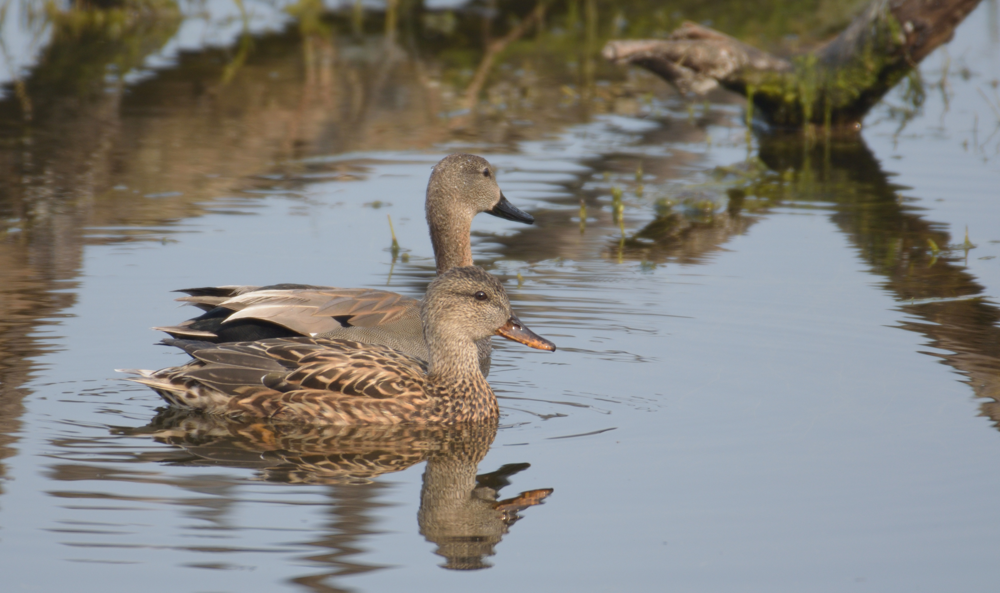

# Photographs

- [Keoladeo National Park - Bharatpur](# keoladeo_national_park-bharatpur)

---

## Keoladeo National Park - Bharatpur

*Jan-Feb 2020*

*Painted Stork. The distinctive pink tertial feathers of the adults give them their name.*

\
&nbsp;
\
&nbsp;

*The canopied mud ways are to be vacated before sunset.*

\
&nbsp;
\
&nbsp;

*Spotted Deers. The fawn and its mother stay together for about one year.*

\
&nbsp;
\
&nbsp;

*Black-necked stork. These are large birds. They grow upto 4 ft tall with 7.5 ft wingspan.*

\
&nbsp;
\
&nbsp;

*Female Nilgais - notice the white patch on neck. Adult males have a bluish-grey coat.*

\
&nbsp;
\
&nbsp;

*Gadwall pair. Female in foreground, male at the aft.*

\
&nbsp;
\
&nbsp;

*Common Kingfisher.  It feeds mainly on fish, caught by diving.*

*A challenge for any diving bird is the change in refraction between air and water.*

*The eyes of many birds have two foveae (the area of the retina with the greatest density of light receptors).*

*A kingfisher can switch from the main central fovea to the auxiliary fovea when it enters water.*

*A retinal streak of high receptor density which connects the two foveae allows the image to swing temporally as the bird drops onto the prey.*

*Source: wikipedia*

\
&nbsp;
\
&nbsp;
 

*Juvenile Spotted Owlets asleep.*

\
&nbsp;
\
&nbsp;

*Rose-ringed Parakeet.*

*The rose-ringed parakeet is sexually dimorphic (the condition where the sexes of the same species exhibit different characteristics, particularly characteristics not directly involved in reproduction).*

*The adult male sports a red and black neck ring, and the hen and immature birds of both sexes either show no neck rings, or display shadow-like pale to dark grey neck rings.*

*Thus, we cannot tell without close observation - if this bird is a female or a juvenile male.*

*Source: wikipedia*

\
&nbsp;
\
&nbsp;

*Shrike.*

\
&nbsp;
\
&nbsp;

